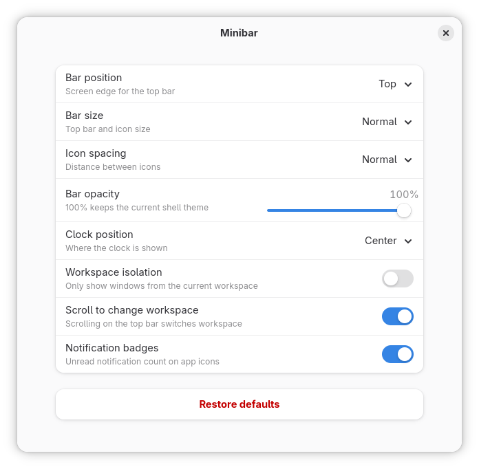

# Minibar — a simple, opinionated taskbar for GNOME

**Strong opinions. Few settings. Small code.**
*The only bar in town with no tabs — opinions served neat, no chaser.*

A minimal taskbar extension for GNOME Shell: favorite and running apps as icons on
the left of the top bar — nothing more.


## What it does

- 🎯 **App icons** in the top bar: pinned favorites first and always visible, then
  other running apps, one icon per app.
- 💄 **Dashes** under each icon: one per open window, accent color when focused.
- ✨ **A few extras**: notification badges on icons, scroll on the bar to switch
  workspace, adjustable bar opacity, size and position, clock position... maybe
  more, but not too much.
- 🧩 **Stock GNOME everywhere else**: native app menus, native workspace OSD, native
  panel — Minibar adds a taskbar, it does not reskin the shell.

## What it deliberately does NOT do

Multi-monitor panels, intellihide, peek, preview grids, Unity badges, clock/weather
widgets, per-feature timing knobs… See the [spec](docs/specs/taskbar.md) — the KISS
principle at the top is the project's constitution, and the maintenance risk map in
§5 explains why small code beats features here.

## Install

Minibar is not on extensions.gnome.org (yet) — install it from a release zip or from source.

### One-liner (latest release)

```bash
curl -L -o /tmp/minibar.zip \
  "https://github.com/essembeh/minibar/releases/latest/download/minibar@essembeh.org.shell-extension.zip" \
  && gnome-extensions install --force /tmp/minibar.zip
# log out / log in, then:
gnome-extensions enable minibar@essembeh.org
```

### From a release zip

Grab `minibar@essembeh.org.shell-extension.zip` from the
[releases page](https://github.com/essembeh/minibar/releases)
(built by CI), then:

```bash
gnome-extensions install --force minibar@essembeh.org.shell-extension.zip
# log out / log in, then:
gnome-extensions enable minibar@essembeh.org
```

### From source

```bash
git clone https://github.com/essembeh/minibar
ln -s "$PWD/minibar/src" ~/.local/share/gnome-shell/extensions/minibar@essembeh.org
# log out / log in, then:
gnome-extensions enable minibar@essembeh.org
```

## Compatibility

GNOME Shell **49 and 50** — developed and tested on 50 (whatever current NixOS
stable ships); 49 is supported on a best-effort basis (same APIs, untested).
No compatibility layers for older versions: the required `Clutter.ClickGesture`
API only exists since 49, and the extension moves forward with GNOME rather than
accumulating shims.

## Settings

Only the strict minimum is configurable — that's the whole point: every knob is a
behavior to maintain, so the extension ships with the few that genuinely change how
the bar feels, and hardcodes the rest.



| Setting                    | Values                                                         | Default |
| -------------------------- | -------------------------------------------------------------- | ------- |
| Bar position               | top · bottom                                                   | top     |
| Bar size                   | normal · large · extra large (bar and icons stay proportional) | normal  |
| Bar opacity                | 0 · 10 · ... · 100, 10% steps                                  | 100     |
| Icon spacing               | small · normal · large                                         | normal  |
| Clock position             | center · right                                                 | center  |
| Workspace isolation        | on · off                                                       | off     |
| Notification badges        | on · off                                                       | on      |
| Scroll to change workspace | on · off                                                       | on      |

## Hacking

`./tests/nested.sh` starts a nested GNOME Shell (devkit) with only this extension
enabled and an isolated dconf — iterate without touching your session
(`./tests/notify-test.sh` exercises the notification badge from inside it). The
[spec](docs/specs/taskbar.md) is the source of truth: any behavior change must be
reflected there first.

## Suggestions welcome, with two filters

I am open to feature suggestions and PRs, as long as:

1. **I find the feature useful** — this is an opinionated extension, not a toolbox;
2. **it carries a low maintenance risk** across GNOME versions (see the risk map in
   the spec: anything fighting shell internals is a hard sell).

## Author's note

> ⚠️ **This extension implements *my* preferences.** It is intentionally light on
> configuration: I felt drowned by the settings pages of the (excellent) alternatives
> that inspired it — [App Icons Taskbar](https://extensions.gnome.org/extension/4944/app-icons-taskbar/)
> and [Tasks in Panel](https://extensions.gnome.org/extension/8642/tasks-in-panel/).
> If you want knobs for everything, use them; if you share my taste, enjoy.

## License

GPL-3.0-or-later
